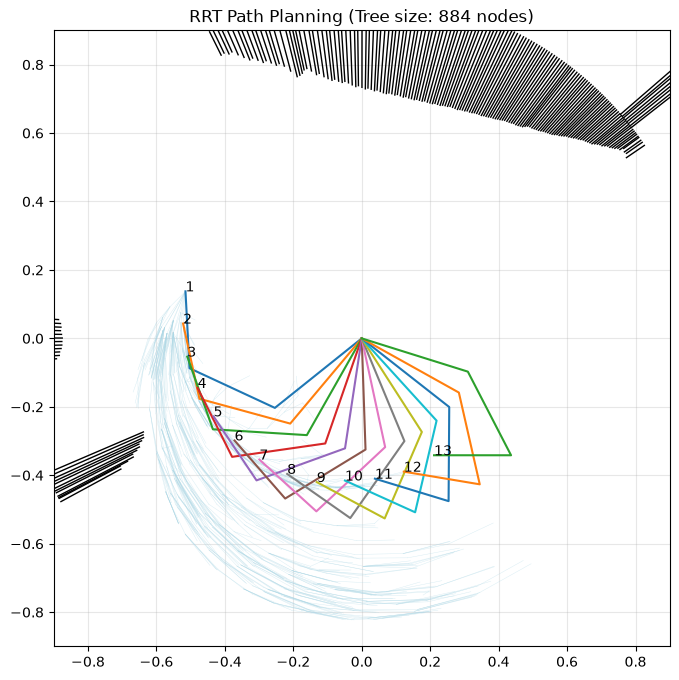

# 3Link SCARA RRT Path Planning

This project implements Rapidly-exploring Random Tree (RRT) path planning for a 3-link planar SCARA/RRR robot arm. The planner searches in joint space while checking collisions in workspace, then renders the resulting robot configurations, search tree, target, and obstacle geometry.

## Output

The generated plot below shows a planned motion for the 3-link arm.



In the visualization:

- Light blue lines show the explored RRT tree in end-effector workspace.
- Numbered arm poses show the final path sequence from the start configuration to the goal region.
- Black/red/green geometry shows obstacles and buffered obstacle regions used for collision checking.
- The `x` marker shows the target point.
- The plot title reports the final tree size.

## Work Conducted

The project builds a complete path-planning pipeline for a 3-link SCARA-style manipulator:

1. Forward kinematics were implemented for batched joint configurations.
2. Inverse kinematics were implemented with a Jacobian pseudo-inverse method for target refinement.
3. A large sampled configuration database is generated and cached for fast target lookup.
4. The sampled kinematics cache now stores both joint angles and Cartesian link positions in `resoucre/angles_pos.pkl`.
5. A KD-tree is used to find candidate joint configurations near a desired workspace target.
6. RRT expansion is performed in joint-angle space using batch sampling.
7. Collision checking converts each robot pose into Shapely `LineString` geometry with a safety buffer.
8. Obstacles are queried efficiently with a Shapely `STRtree`.
9. The final path is reconstructed from the goal node back to the start node.
10. A path smoothing utility attempts to remove unnecessary waypoints while preserving collision-free motion.
11. The renderer plots obstacles, the RRT tree, the target, and numbered full-arm path configurations.

## Repository Layout

```text
.
|-- README.md
|-- RRT.py
|-- improvement_step.py
|-- main.ipynb
|-- output.png
|-- utlis.py
`-- resoucre/
    |-- angles.pkl
    |-- angles_pos.pkl
    |-- laser.pickle
    `-- robot_position.pickle
```

## Main Files

### `RRT.py`

Contains the main `RRTAngleBatch` planner. It handles:

- robot parameters and joint limits
- sampled kinematics cache loading
- KD-tree lookup for target candidates
- RRT node expansion
- obstacle collision checking
- path reconstruction
- plotting and rendering

### `utlis.py`

Contains shared utility functions, including:

- `forward_kinematics_batch`
- distance-to-line calculations
- laser point processing helpers

### `improvement_step.py`

Contains additional kinematics and direct-motion utilities:

- single-pose forward kinematics
- Jacobian calculation
- inverse kinematics
- direct motion collision checking

### `main.ipynb`

Notebook workspace used to run experiments, load data, build obstacles, run the planner, and generate output plots.

## Planner Overview

The robot is modeled as a 3-link planar arm with link lengths:

```python
[0.325, 0.275, 0.225]
```

The joint limits are:

```python
[
    [-pi/2,    pi/2],
    [-3*pi/4,  3*pi/4],
    [-3*pi/4,  3*pi/4],
]
```

The planner first samples many random joint configurations, computes their forward kinematics, and saves the result. During planning, the target point is queried against the cached end-effector positions to find possible goal configurations. The RRT then grows from the start joint configuration toward random samples and target-biased samples until a valid goal configuration is reached.

## Rendering

The renderer in `RRT.py` displays:

- obstacle polygons and original obstacle shapes
- RRT tree edges
- full robot arm poses along the path
- numbered end-effector locations
- target marker

Example call:

```python
fig = rrt.render(path, target=target)
fig.savefig("output.png", dpi=150)
```

## Dependencies

The project uses:

- `numpy`
- `scipy`
- `matplotlib`
- `shapely`
- `tqdm`
- `pickle` from the Python standard library

Install the external packages with:

```bash
pip install numpy scipy matplotlib shapely tqdm
```

## Notes

- The `resoucre/` directory name is preserved as it exists in the current project.
- The kinematics cache can be large because it stores many sampled robot configurations.
- If `resoucre/angles_pos.pkl` does not exist, the planner will build it the first time `load_kinematics_tree()` runs.
